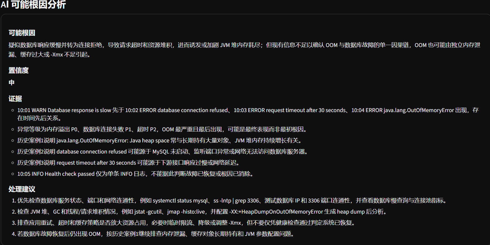

# Intelligent Log Analyzer

一个基于 **FastAPI + RAG + DeepSeek** 的智能日志异常诊断系统。

用户上传 `.log` 或 `.txt` 日志文件后，系统会自动完成日志解析、异常分类、严重等级判断、代表性异常提取、历史故障案例检索，并结合大语言模型生成可能根因分析、分析证据和可执行处理建议。

---

## Demo

### AI 智能诊断结果



### 异常识别与严重度分级


### 系统首页


---

## 功能

### 日志解析

支持解析日志中的：

- INFO / WARN / ERROR / UNKNOWN
- 各日志等级数量
- 各日志等级比例
- 时间戳
- ERROR 日志

### 异常分类

当前支持：

- 数据库连接失败
- 内存溢出
- 空指针异常
- 超时
- 其他异常

### 严重等级

| 异常类型 | 严重等级 |
| --- | --- |
| 内存溢出 | P0 |
| 数据库连接失败 | P1 |
| 超时 | P2 |
| 空指针异常 | P2 |
| 其他异常 | P3 |

### 代表性异常提取

系统不会直接把整个日志文件发送给大模型，而是：

1. 提取 ERROR 日志
2. 进行异常分类
3. 按 P0 → P1 → P2 → P3 排序
4. 对相同异常类型去重
5. 最多保留 3 条代表性异常
6. 提取异常前后 ±5 行上下文

这样可以减少无关日志和重复信息，同时降低 LLM Token 消耗。

### RAG 历史案例检索

系统使用：

- `BAAI/bge-base-zh-v1.5`
- Chroma
- LangChain

构建本地历史故障案例知识库。

异常日志通过本地 Embedding 模型转换为向量，并在 Chroma 中检索语义相似的历史故障案例。

为了避免多个不同异常混合成一个查询后产生语义偏移，系统会对代表性异常分别进行检索，再对检索结果进行合并和去重。

Embedding 模型在进程内进行缓存，避免重复初始化。

历史案例向量库支持安全重建：重建时删除旧 collection，并使用案例 ID 作为固定向量 ID，避免重复初始化导致相同案例重复写入。

### AI 可能根因分析

系统将以下信息提供给 LLM：

- 代表性异常
- 严重等级
- 去重后的日志上下文
- RAG 检索到的历史案例

LLM 输出：

- 可能根因
- 分析证据
- 置信度
- 可执行处理建议

系统通过 Prompt 约束模型使用“可能”“疑似”等谨慎措辞，避免把推测直接描述成确定事实。

### LLM 故障降级

如果 LLM 因以下情况调用失败：

- API 不可用
- 网络异常
- 余额不足
- 请求异常
- 返回格式异常

系统仍可以正常返回：

- 日志解析结果
- 异常分类
- 严重等级
- 代表性异常
- RAG 历史案例

避免外部大模型服务异常导致整个分析接口不可用。

---

## 系统架构

```text
用户上传日志
      |
      v
Gradio Frontend
      |
      | HTTP POST /upload
      v
FastAPI Backend
      |
      v
文件校验
      |
      v
日志解析 Parser
      |
      v
异常分类 + Severity
      |
      v
代表性异常选择
      |
      v
±5 行日志上下文
      |
      v
本地 BGE Embedding
      |
      v
Chroma 向量检索
      |
      v
Top 3 历史故障案例
      |
      v
DeepSeek LLM
      |
      v
可能根因 + 证据 + 建议
      |
      v
FastAPI JSON Response
      |
      v
Gradio 展示
```

---

## 技术栈

### Backend

- Python 3.11
- FastAPI
- Pydantic
- Uvicorn

### AI / RAG

- DeepSeek API
- LangChain
- BAAI/bge-base-zh-v1.5
- Chroma
- sentence-transformers

### Frontend

- Gradio
- Requests

### Engineering

- pytest
- pytest-cov
- python-dotenv
- Structured Logging
- trace_id
- Git / GitHub

---

## 工程设计亮点

### 规则与 LLM 分工

对于日志等级解析、异常分类、严重等级判断等确定性任务，优先使用本地规则处理。

LLM 主要负责：

- 多异常之间的语义关联分析
- 可能根因生成
- 证据整理
- 可执行处理建议生成

这样可以减少不必要的模型调用，降低成本和幻觉风险。

### Representative Error Selection

不会将整个日志文件直接发送给 LLM，而是优先选择高严重等级、不同异常类型的代表性错误，并附带相关上下文。

### RAG 分别检索再合并

不同异常分别进行向量检索，再合并和去重历史案例。

避免：

```text
OOM + Database Error + Timeout
```

被直接混合成一个查询后，由某一种语义主导最终检索结果。

### LLM Graceful Degradation

LLM 调用异常时不会导致整个接口失败。

Parser、Classifier、Severity 和 RAG 结果仍然可以正常返回。

### Chroma 幂等重建

知识库重建时删除旧 collection，并通过固定案例 ID 重新写入。

避免重复执行初始化后产生重复历史案例。

### Embedding 缓存

通过进程内缓存复用 Embedding 模型实例，降低重复模型初始化带来的开销。

### trace_id

每次 FastAPI 上传请求生成独立 `trace_id`。

上传、解析、检索、生成和最终分析日志可以通过同一个 `trace_id` 进行关联，方便排查完整调用链路。

---

## 项目结构

```text
log-analyzer/
├── app/
│   ├── __init__.py
│   ├── analyzer.py
│   ├── log_classifier.py
│   ├── log_parser.py
│   ├── main.py
│   ├── models.py
│   │
│   ├── services/
│   │   ├── __init__.py
│   │   ├── anomaly_selector.py
│   │   ├── llm_analyzer.py
│   │   └── rag_engine.py
│   │
│   └── utils/
│       ├── __init__.py
│       ├── config.py
│       └── logger.py
│
├── data/
│   ├── historical_cases.json
│   └── sample.log
│
├── docs/
│   ├── demo-ai.png
│   ├── demo-errors.png
│   └── home.png
│
├── frontend/
│   ├── __init__.py
│   └── app.py
│
├── tests/
│   ├── test_analyzer.py
│   ├── test_anomaly_selector.py
│   ├── test_api.py
│   ├── test_classifier.py
│   ├── test_llm_analyzer.py
│   └── test_parser.py
│
├── .env.example
├── .gitignore
├── README.md
└── requirements.txt
```

---

## 环境配置

推荐使用：

```text
Python 3.11
```

安装依赖：

```bash
pip install -r requirements.txt
```

根据：

```text
.env.example
```

创建：

```text
.env
```

配置示例：

```env
API_KEY=
BASE_URL=
MODEL_NAME=

CHUNK_SIZE=1000
DB_PATH=./data/chroma_db

EMBEDDING_MODEL_PATH=

ENABLE_LLM=false
MAX_LLM_TOKENS=500
```

其中：

- `API_KEY`：DeepSeek API Key
- `BASE_URL`：LLM API Base URL
- `MODEL_NAME`：模型名称
- `DB_PATH`：Chroma 本地持久化目录
- `EMBEDDING_MODEL_PATH`：本地 `BAAI/bge-base-zh-v1.5` 模型路径
- `ENABLE_LLM`：是否启用真实 LLM 调用

> 不要将真实 API Key 提交到 GitHub。

`.env` 已加入 `.gitignore`。

---

## 构建历史案例向量库

首次使用 RAG 前，需要根据：

```text
data/historical_cases.json
```

构建 Chroma 向量数据库。

```python
from app.services.rag_engine import rebuild_vector_store

rebuild_vector_store()
```

生成的数据默认保存到：

```text
data/chroma_db/
```

该目录属于运行时生成数据，不提交到 GitHub。

---

## 启动后端

在项目根目录运行：

```bash
uvicorn app.main:app
```

FastAPI：

```text
http://127.0.0.1:8000
```

Swagger：

```text
http://127.0.0.1:8000/docs
```

---

## 启动前端

保持 FastAPI 后端运行，再打开第二个终端：

```bash
python -m frontend.app
```

浏览器访问：

```text
http://127.0.0.1:7860
```

Gradio 前端通过 HTTP 请求调用 FastAPI `/upload` 接口，而不是直接调用内部业务函数。

---

## API

### POST `/upload`

支持：

```text
.log
.txt
```

文件。

当前限制：

```text
最大文件大小：10 MB
编码：UTF-8
```

统一响应格式：

```json
{
  "code": 0,
  "message": "success",
  "data": {}
}
```

部分业务码：

| HTTP Status | Business Code | Description |
| --- | --- | --- |
| 200 | 0 | Success |
| 400 | 4001 | Unsupported file type |
| 400 | 4002 | File too large |
| 400 | 4003 | Invalid UTF-8 |
| 500 | 5000 | Internal server error |

---

## 测试

运行：

```bash
pytest tests/
```

当前测试结果：

```text
42 passed
```

测试覆盖：

- Parser 正常输入与边界输入
- 日志异常分类
- Severity
- 代表性异常选择
- 相同异常类型去重
- 上下文边界
- Analyzer 编排逻辑
- LLM disabled 降级
- LLM Exception 降级
- FastAPI 正常文件上传
- 非法文件类型
- 非 UTF-8 文件

RAG 和 LLM 等外部或高开销依赖在单元测试中通过 Mock 隔离，避免自动化测试依赖真实网络和付费 API。

---

## 测试覆盖率

运行：

```bash
pytest --cov=app --cov-report=term-missing tests/
```

当前测试覆盖率：

```text
TOTAL Coverage: 82%
Tests: 42 passed
```

部分核心模块：

```text
Analyzer                100%
Anomaly Selector        100%
Log Parser               95%
LLM Analyzer             87%
FastAPI Main             85%
```

RAG 模块涉及本地 Embedding 模型和 Chroma 持久化等较重依赖，因此单元测试主要通过 Mock 隔离外部依赖。

---

## Structured Logging

系统使用 JSON 结构化日志。

日志字段包括：

```text
timestamp
level
module
message
trace_id
```

核心链路日志包括：

```text
upload started
parse completed
retrieval completed
generation completed
analysis completed
```

同一次 FastAPI 请求中的日志使用相同 `trace_id`，方便关联完整分析链路。

---

## 为什么没有把整个日志直接交给 LLM？

将整个日志文件直接发送给大模型可能带来：

- 更高 Token 成本
- 更多无关信息
- 重复异常
- Prompt 上下文噪声
- 更高响应延迟
- 输出稳定性降低

因此本项目采用：

```text
规则解析
→ 规则分类
→ Severity
→ Representative Errors
→ RAG
→ 单次 LLM 分析
```

确定性任务由程序完成，只将需要语义推理的部分交给 LLM。

---

## 当前版本

当前 V1 已完成：

- [x] 日志文件上传
- [x] 日志解析
- [x] 异常分类
- [x] 严重等级
- [x] 代表性异常选择
- [x] ±5 行上下文
- [x] 本地 Embedding
- [x] Chroma RAG
- [x] DeepSeek 可能根因分析
- [x] AI 分析证据
- [x] AI 置信度
- [x] 可执行处理建议
- [x] LLM 故障降级
- [x] FastAPI
- [x] Gradio
- [x] Gradio HTTP 调用 FastAPI
- [x] Structured Logging
- [x] trace_id
- [x] pytest
- [x] 42 个自动化测试
- [x] 82% 测试覆盖率
- [x] Embedding 模型缓存
- [x] Chroma 幂等重建
- [x] 完整 AI 端到端演示
- [ ] Docker
- [ ] 公网部署

---

## 后续计划

- Docker / Docker Compose 部署
- 增加更多真实日志格式
- 增加历史故障案例
- 优化向量数据库增量更新
- 增加系统性能指标
- 支持实时日志采集
- 尝试扩展为运维故障排查 Agent

---

## V2 Ideas

后续可以使用 Docker 搭建可控故障环境，例如：

```text
MySQL
Redis
Web Service
```

通过人为制造：

```text
Database connection refused
Timeout
OOM
```

等故障，生成更接近真实生产环境的日志。

进一步扩展为：

```text
实时日志采集
→ 自动异常发现
→ RAG
→ AI 故障诊断
→ 运维告警
```