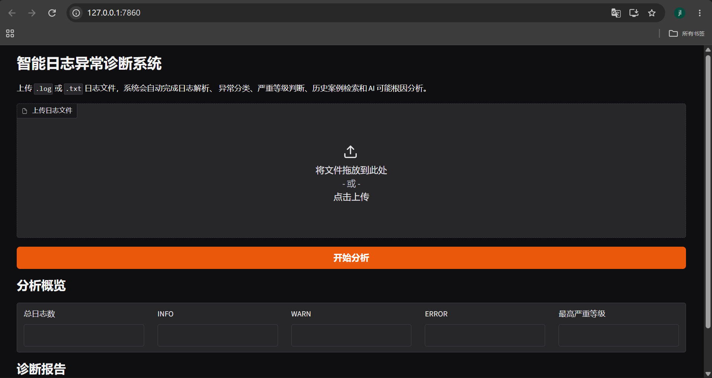
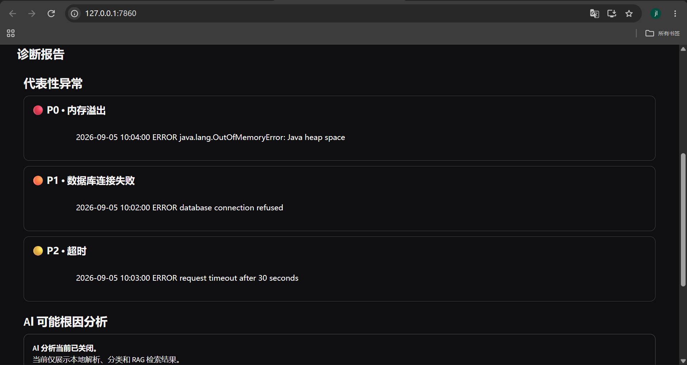
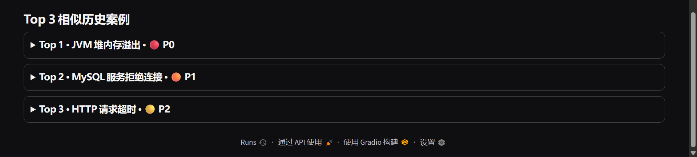

# Intelligent Log Analyzer

一个基于 **FastAPI + RAG + DeepSeek** 的智能日志异常诊断系统。

用户上传 `.log` 或 `.txt` 日志文件后，系统会自动完成日志解析、异常分类、严重等级判断、代表性异常提取、历史故障案例检索，并结合大语言模型生成可能根因分析和可执行处理建议。

---

## Demo

### 系统首页



### 异常诊断结果



### RAG 相似历史案例



> 当前截图展示本地日志解析、异常分类、严重等级判断和 RAG 检索结果。最终 AI 根因分析演示将在开启 LLM 后补充。

---

## 功能

### 日志解析

支持解析日志中的：

- INFO / WARN / ERROR / UNKNOWN
- 各日志等级数量
- 各日志等级比例
- 时间戳
- ERROR 日志

### 异常分类

当前支持：

- 数据库连接失败
- 内存溢出
- 空指针异常
- 超时
- 其他异常

### 严重等级

| 异常类型 | 严重等级 |
| --- | --- |
| 内存溢出 | P0 |
| 数据库连接失败 | P1 |
| 超时 | P2 |
| 空指针异常 | P2 |
| 其他异常 | P3 |

### 代表性异常提取

系统不会直接把全部日志发送给大模型，而是：

1. 提取 ERROR 日志
2. 进行异常分类
3. 按 P0 → P1 → P2 → P3 排序
4. 对相同异常类型进行去重
5. 最多保留 3 条代表性异常
6. 提取异常前后 ±5 行日志上下文

这样可以减少无关日志和重复信息，同时降低 LLM Token 消耗。

### RAG 历史案例检索

系统使用：

- `BAAI/bge-base-zh-v1.5`
- Chroma
- LangChain

构建本地历史故障案例知识库。

当前异常会通过本地 Embedding 模型转换为向量，并在 Chroma 中检索语义最相关的历史故障案例。

为了避免多个不同异常混合成一个查询导致语义偏移，系统会对代表性异常分别检索，再对历史案例结果进行合并和去重。

Embedding 模型在进程内进行缓存，避免每次检索重复初始化模型。

历史案例向量库支持安全重建：重建时会删除旧 collection，并使用案例 ID 作为固定向量 ID，避免重复初始化导致相同案例被重复写入。

### AI 可能根因分析

系统将以下信息发送给 LLM：

- 代表性异常
- 严重等级
- 去重后的日志上下文
- RAG 检索到的历史案例

LLM 输出：

- 可能根因
- 分析证据
- 置信度
- 可执行处理建议

系统不会把模型推测直接描述成确定事实，而是使用“可能”“疑似”等谨慎措辞。

### LLM 故障降级

如果 LLM 因为以下原因调用失败：

- API 不可用
- 网络异常
- 余额不足
- 请求超时
- 返回格式异常

系统仍然可以正常返回：

- 日志解析结果
- 异常分类
- 严重等级
- 代表性异常
- RAG 历史案例

避免外部大模型服务异常导致整个日志分析接口不可用。

---

## 系统架构

```text
用户上传日志
      |
      v
Gradio Frontend
      |
      | HTTP POST /upload
      v
FastAPI Backend
      |
      v
文件校验
      |
      v
日志解析 Parser
      |
      v
异常分类 + Severity
      |
      v
代表性异常选择
      |
      v
±5 行日志上下文
      |
      v
本地 BGE Embedding
      |
      v
Chroma 向量检索
      |
      v
Top 3 历史故障案例
      |
      v
DeepSeek LLM
      |
      v
可能根因 + 证据 + 建议
      |
      v
FastAPI JSON Response
      |
      v
Gradio 展示
技术栈
Backend
Python 3.11
FastAPI
Pydantic
Uvicorn
AI / RAG
DeepSeek API
LangChain
BAAI/bge-base-zh-v1.5
Chroma
sentence-transformers
Frontend
Gradio
Requests
Engineering
pytest
pytest-cov
python-dotenv
Structured Logging
trace_id
Git / GitHub
工程设计亮点
规则与 LLM 分工

对于日志等级解析、异常分类、严重等级等确定性任务，优先使用本地规则处理。

LLM 主要负责：

多异常之间的语义关联分析
可能根因生成
证据整理
可执行处理建议生成

这样可以降低模型调用成本，同时减少不必要的幻觉。

Representative Error Selection

不会将整个日志文件直接发送给 LLM，而是优先选择高严重等级、不同异常类型的代表性错误，并附带上下文。

这样可以减少 Token 消耗和重复信息。

RAG 分别检索再合并

不同异常不会简单拼接成一个超长查询，而是分别进行向量检索。

这样可以避免：

OOM + Database Error + Timeout

混合成同一个 embedding 后导致某一种语义主导检索结果。

LLM Graceful Degradation

LLM 失败时不会导致整个接口失败。

Parser、Classifier、Severity 和 RAG 结果仍可以正常返回。

Chroma 幂等重建

知识库重建时会删除旧 collection，并通过固定案例 ID 重新写入。

避免重复执行初始化操作后产生重复历史案例。

Embedding 缓存

通过进程内缓存复用 Embedding 模型实例，降低重复初始化带来的额外开销。

trace_id

每次 FastAPI 上传请求都会生成独立的 trace_id。

同一次请求中的上传、解析、检索、生成和分析日志都可以通过同一个 trace_id 进行关联。

项目结构
log-analyzer/
├── app/
│   ├── __init__.py
│   ├── analyzer.py
│   ├── log_classifier.py
│   ├── log_parser.py
│   ├── main.py
│   ├── models.py
│   │
│   ├── services/
│   │   ├── __init__.py
│   │   ├── anomaly_selector.py
│   │   ├── llm_analyzer.py
│   │   └── rag_engine.py
│   │
│   └── utils/
│       ├── __init__.py
│       ├── config.py
│       └── logger.py
│
├── data/
│   ├── historical_cases.json
│   └── sample.log
│
├── docs/
│   ├── home.png
│   ├── demo-errors.png
│   └── demo-rag.png
│
├── frontend/
│   ├── __init__.py
│   └── app.py
│
├── tests/
│   ├── test_analyzer.py
│   ├── test_anomaly_selector.py
│   ├── test_api.py
│   ├── test_classifier.py
│   ├── test_llm_analyzer.py
│   └── test_parser.py
│
├── .env.example
├── .gitignore
├── README.md
└── requirements.txt
环境配置

推荐使用 Python 3.11。

安装依赖：

pip install -r requirements.txt

复制：

.env.example

创建：

.env

配置示例：

API_KEY=
BASE_URL=
MODEL_NAME=

CHUNK_SIZE=1000
DB_PATH=./data/chroma_db

EMBEDDING_MODEL_PATH=

ENABLE_LLM=false
MAX_LLM_TOKENS=500

其中：

API_KEY

用于配置 DeepSeek API Key。

EMBEDDING_MODEL_PATH

用于配置本地 BAAI/bge-base-zh-v1.5 模型路径。

不要将真实 API Key 提交到 GitHub。

项目中的 .env 已加入 .gitignore。

构建历史案例向量库

首次使用 RAG 前，需要根据：

data/historical_cases.json

构建 Chroma 向量数据库。

可以调用：

from app.services.rag_engine import rebuild_vector_store

rebuild_vector_store()

知识库会持久化到：

data/chroma_db/

该目录属于运行时生成数据，不提交到 GitHub。

启动后端

在项目根目录运行：

uvicorn app.main:app

默认地址：

http://127.0.0.1:8000

Swagger：

http://127.0.0.1:8000/docs
启动前端

保持 FastAPI 后端运行，再打开第二个终端：

python -m frontend.app

默认访问：

http://127.0.0.1:7860

当前前端通过 HTTP 请求调用 FastAPI /upload 接口，而不是直接调用内部业务函数。

API
POST /upload

支持上传：

.log
.txt

当前限制：

最大文件大小：10 MB
编码：UTF-8

统一响应格式：

{
  "code": 0,
  "message": "success",
  "data": {}
}

部分业务码：

HTTP Status	Business Code	Description
200	0	Success
400	4001	Unsupported file type
400	4002	File too large
400	4003	Invalid UTF-8
500	5000	Internal server error
测试

运行：

pytest tests/

当前测试结果：

42 passed

测试覆盖：

Parser 正常和边界输入
日志异常分类
Severity
代表性异常选择
相同异常类型去重
上下文边界
Analyzer 编排逻辑
LLM disabled 降级
LLM Exception 降级
FastAPI 文件上传
非法文件类型
非 UTF-8 文件

RAG 和 LLM 等外部或高开销依赖在单元测试中使用 Mock，避免自动化测试依赖真实网络和付费 API。

测试覆盖率

运行：

pytest --cov=app --cov-report=term-missing tests/

当前结果：

TOTAL Coverage: 82%
Tests: 42 passed

核心模块包括：

Analyzer                100%
Anomaly Selector        100%
Log Parser               95%
LLM Analyzer             87%
FastAPI Main             85%

RAG 模块包含本地 Embedding 模型加载和 Chroma 持久化等重依赖操作，因此单元测试主要通过 Mock 隔离外部依赖。

Structured Logging

系统使用 JSON 结构化日志。

日志字段包括：

timestamp
level
module
message
trace_id

核心链路日志包括：

upload started
parse completed
retrieval completed
generation completed
analysis completed

同一次 FastAPI 请求中的日志使用相同的 trace_id，方便排查和关联完整调用链路。

为什么没有把所有日志直接交给 LLM？

将整个日志文件直接发送给大模型会带来：

更高 Token 成本
更多无关信息
重复异常
Prompt 上下文噪声
更高延迟
更难保证输出稳定性

因此本项目采用：

规则解析
→ 规则分类
→ Severity
→ Representative Errors
→ RAG
→ 单次 LLM 分析

让确定性工作由程序完成，仅将需要语义推理的部分交给 LLM。

当前版本

当前 V1 已完成：

 日志文件上传
 日志解析
 异常分类
 严重等级
 代表性异常选择
 ±5 行上下文
 本地 Embedding
 Chroma RAG
 DeepSeek 可能根因分析
 LLM 故障降级
 FastAPI
 Gradio
 Gradio HTTP 调用 FastAPI
 Structured Logging
 trace_id
 pytest
 42 个自动化测试
 82% 测试覆盖率
 Embedding 模型缓存
 Chroma 幂等重建
 Docker
 公网部署
后续计划
Docker / Docker Compose 部署
增加更多真实日志格式
增加历史故障案例
优化向量数据库增量更新
增加系统性能指标
支持实时日志采集
尝试运维故障排查 Agent
V2 Ideas

后续可以使用 Docker 搭建可控故障环境，例如：

MySQL
Redis
Web Service

通过人为制造：

Database connection refused
Timeout
OOM

等故障，生成更接近真实生产环境的日志。

然后进一步扩展为：

实时日志采集
→ 自动异常发现
→ RAG
→ AI 故障诊断
→ 运维告警